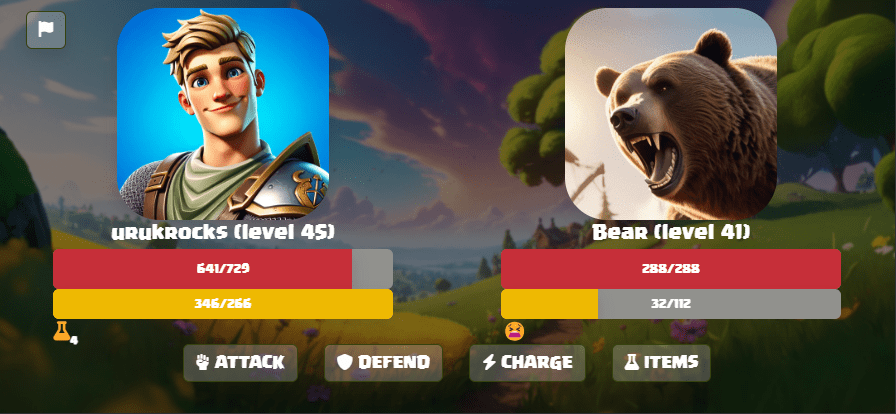
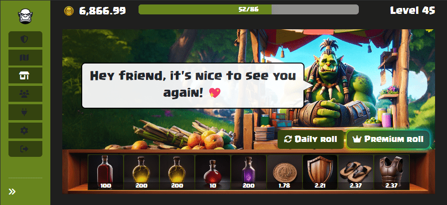

# ⚔️ Game Mechanics

**Quests:**

* Uruk Bartas currently features a simple cycle of quests, combat, and rewards, though it will evolve into a more complex system in the future.
* Presently, there are three quests available for players to complete. Upon completing one, a new quest is added based on the player's level and statistics, ensuring a constant challenge.
* Each quest features a different monster, providing variety and excitement for players.
* Both items and quests have rarities, ranging from common to mythical. The rarity of an item determines its strength, and the difficulty of a quest increases with its rarity.

**Combat System:**

* Combat in Uruk Bartas is turn-based, reminiscent of classic RPGs like Dragon Quest and Final Fantasy.
* Players have various actions they can take during their turn:
  * Attack: Inflicts base damage on the enemy.
  * Defend: Reduces incoming damage and restores energy.
  * Charge: Restores energy and prepares for a more powerful attack.
  * Use consumables: Items that provide buffs or other effects.
* The goal of combat is to reduce the opponent's health points to zero. Upon victory, players receive rewards based on the quest's rarity and difficulty.

<figure><figcaption></figcaption></figure>

**Vendor and Item System:**

* The vendor in Uruk Bartas sells items and consumables tailored to the player's level.
* Players can purchase items from the vendor and also reset the available items for free daily, or by using a premium roll at a cost in Uruks.
* Items and consumables play a crucial role in enhancing a player's abilities and survivability in combat.

<figure><figcaption></figcaption></figure>
