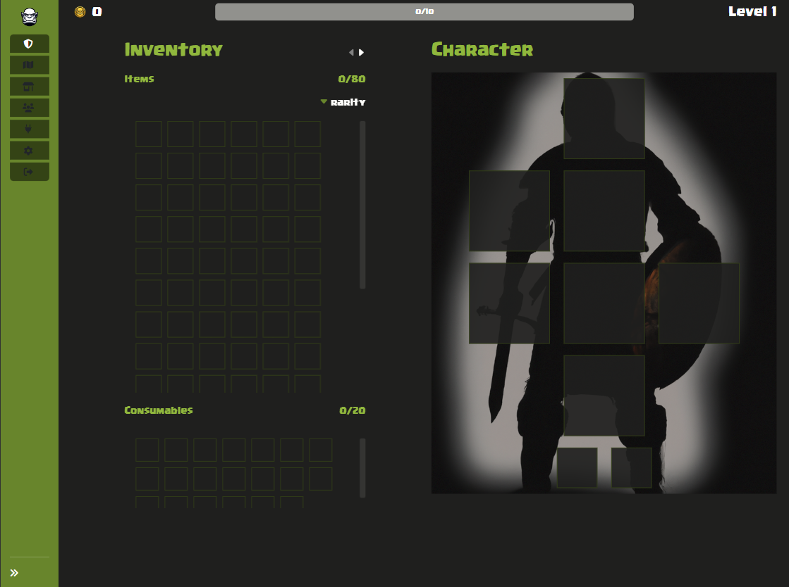

# 📈 Getting Started

1. **Install Your Favorite Web3 Wallet:**
   * Before diving into the world of "Uruk Bartas," ensure you have your preferred web3 wallet installed. We recommend using Metamask for its compatibility and ease of use. If you haven't already installed it, you can download Metamask from [here](https://metamask.io/download/).
2. **Begin Your Adventure:**
   * Once you have your web3 wallet set up, navigate to the "Uruk Bartas" website and click on the "Begin your adventure" button.
3. **Sign Authentication (if needed):**
   * If the authentication process doesn't activate automatically, you may need to manually sign authentication with your web3 wallet. Follow the prompts on your wallet interface to complete this step.
4.  **Complete the Registration Form:**

    <figure><figcaption></figcaption></figure>

    * After authentication, you'll be prompted to fill out a registration form with your desired username and email address. This information will be used for game alerts and other notifications.
5.  **Start Your Adventure:**

    * Once you've completed these steps, you're ready to embark on your adventure in "Uruk Bartas"! Explore the immersive world, battle fierce monsters, and claim valuable rewards as you journey through the realm.

    <figure><figcaption></figcaption></figure>
