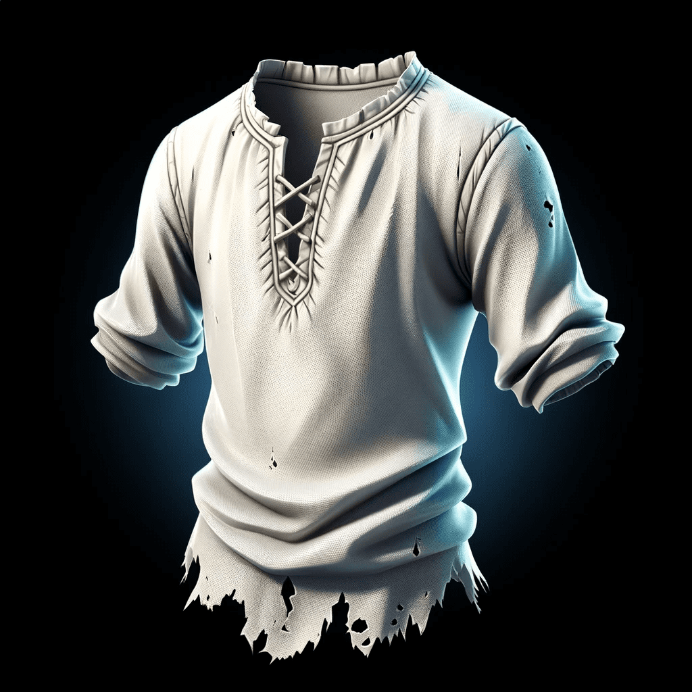
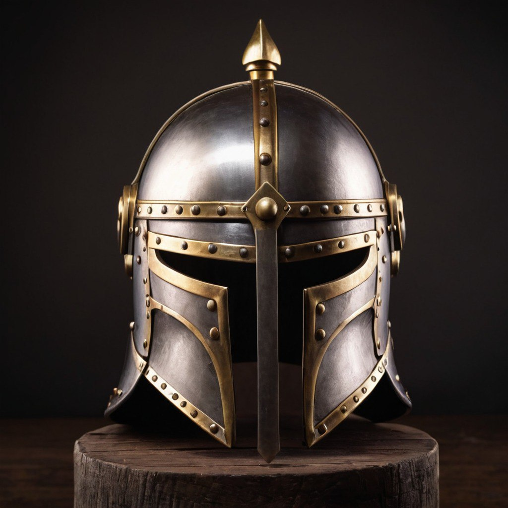
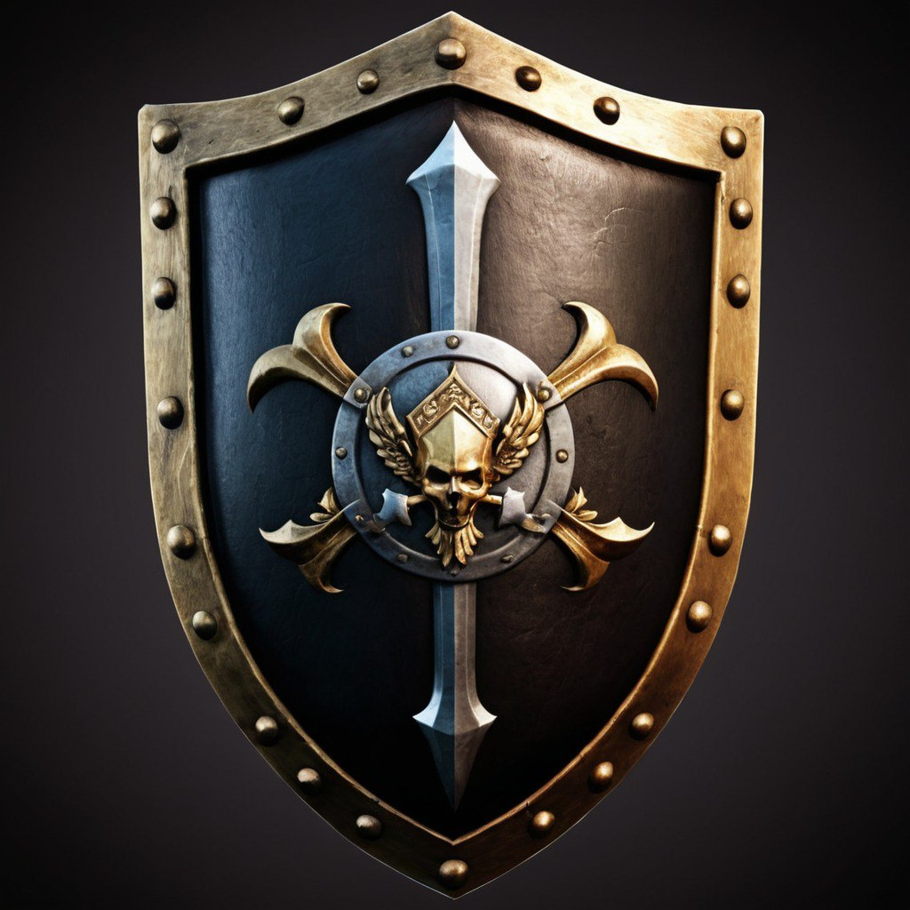
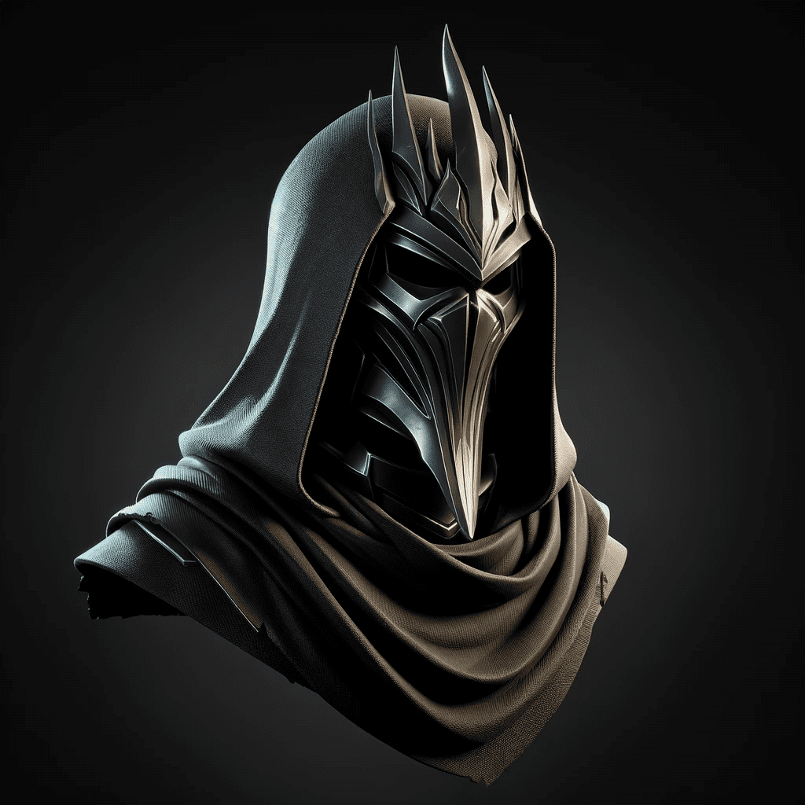

# 💎 Rarities

1. **Common:** The most basic rarity, common quests and items are readily available and offer modest benefits suitable for beginners.&#x20;

<figure><figcaption>
A common chest armor
</figcaption></figure>

1. <mark style="color:blue;">**Uncommon**</mark>**:** Slightly rarer than common, uncommon quests and items provide more significant enhancements and present moderate challenges for players.

<figure><figcaption>
An uncommon helmet, "Shadowfang Viking Helm"
</figcaption></figure>

1. <mark style="color:purple;">**Epic**</mark>**:** Rare and powerful, epic quests and items offer substantial benefits and require advanced skills to complete or obtain.

<figure><figcaption>
An epic shield, "Kraken's embrace"
</figcaption></figure>

1. <mark style="color:orange;">**Legendary**</mark>**:** Exceptionally rare and highly sought after, legendary quests and items provide extraordinary advantages and are coveted by all players.

<figure><figcaption>
A legendary sword, forged by the gods of the undead mountain.
</figcaption></figure>

1. <mark style="color:red;">**Mythical**</mark>**:** The rarest and most coveted rarity, mythical quests and items offer unparalleled benefits and represent the pinnacle of achievement for dedicated players.

<figure><figcaption>
The undead helmet, one of the fewest items.
</figcaption></figure>
