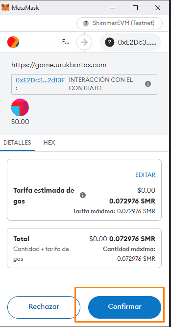

# Sending Items to Other Players

Welcome to our tutorial on sending items to fellow players in the Uruk Bartas game! In this guide, we'll walk you through the simple steps of using our smart contracts to send equipable items to other players. Let's dive in!

**Step 1:** Navigate to the Export Section To begin, locate and click on the "Export" section within the game interface. Here, you'll find the option to select the item you wish to send to another player.

<figure><figcaption></figcaption></figure>

**Step 2:** Retrieving the Exported Item After exporting the item, it will be transferred to your wallet. However, keep in mind that the item will be unavailable for gameplay until you import it back. To do this, you can navigate to the import section by clicking the slider button.

Once in the import section, you'll see a list of all the game NFTs in your wallet, including the item you just exported. You can easily identify it among your collection.

Additionally, if you'd like to visualize the item in your preferred web3 wallet, such as Metamask, simply click on "Add Asset to Wallet."

With these steps, you'll have your exported item ready to be imported back into the game for further use or to be sent to another player.

<figure><figcaption></figcaption></figure>

<figure><figcaption></figcaption></figure>

**Step 3:** Adding the NFT to Your Wallet Once you've selected "Add Asset to Wallet," you'll be prompted to add the NFT to your wallet. Please be patient, as this process may take a few seconds while the communication with IPFS completes.

Once added, the item will be readily available in your wallet, empowering you to engage in various actions. You can trade it in a marketplace, visualize it, or, as we're focusing on in this tutorial, send it to another player.

To initiate the sending process, simply click on the "Send" button and select the NFT you just imported.&#x20;

<figure><figcaption></figcaption></figure>

Once you've sent the item to your friend, the process of importing it back into the game is straightforward. Your friend simply needs to head to the import section within the game interface, locate the item among their collection, and proceed to import it.&#x20;

This seamless reversal of the export process ensures that the item swiftly becomes available for use in gameplay, allowing your friend to enjoy its benefits without any hassle.

<figure><figcaption></figcaption></figure>

<figure><figcaption></figcaption></figure>

After completing the import process, your friend's item is now primed for battle! ⚔️⚔️ With the item securely imported back into the game, they're fully equipped to engage in thrilling combat adventures and make the most of its capabilities.

<figure><figcaption></figcaption></figure>

With the item safely transferred and ready for action, it's time to embark on new adventures! May your gameplay be filled with excitement and triumph. Until next time, happy gaming!
